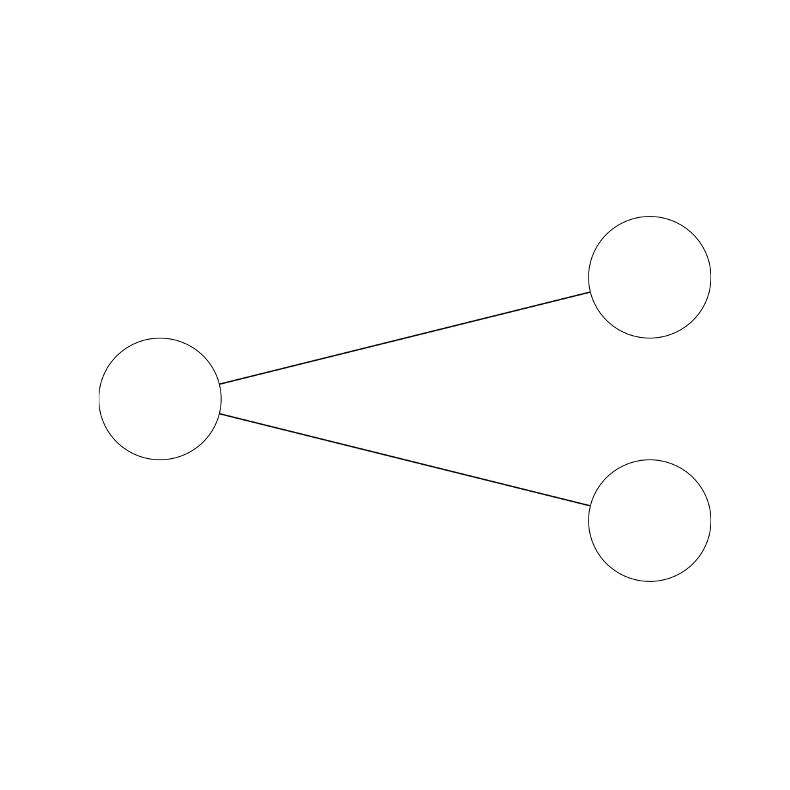
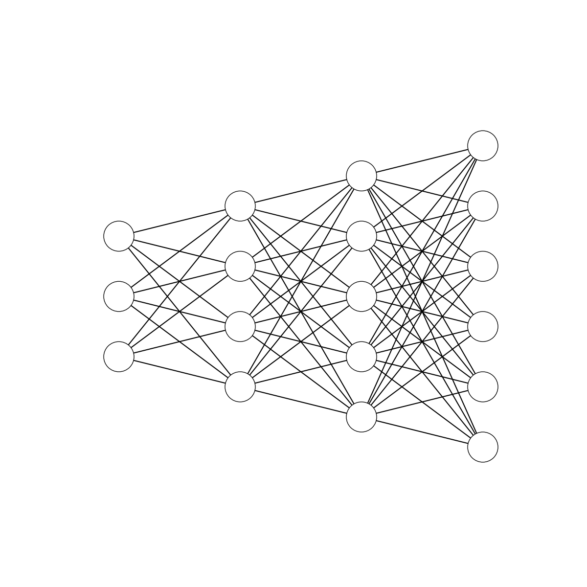
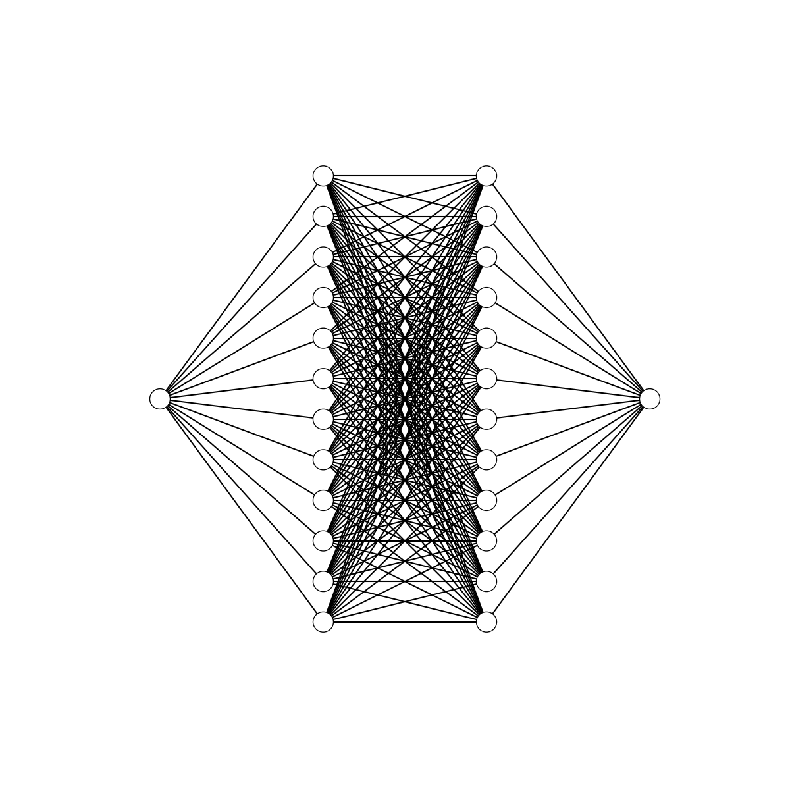

# Quick tool to draw fully connected neural network architectures

## USAGE:  

  BASE URL = `http://xyz.com:8093/plot`  
  PARAMS  = `nodes=2&nodes=5&nodes=10`
  
<a href="https://tracking.gitads.io/?repo=draw-neural-network/"> Check out </a>  
Use the base url and append the values with param name as *nodes* . Each param represents the layers and its value represents the number of nodes in that layer.

For example here are some of the results:

URL = http://xyz.com:8093/plot?nodes=1&nodes=2

URL = http://xyz.com:8093/plot?nodes=3&nodes=4&nodes=5&nodes=6

URL = http://xyz.com:8093/plot?nodes=1&nodes=10&nodes=10&nodes=1

Hope this will help.
<a href="https://tracking.gitads.io/?repo=draw-neural-network/"> Check out </a>
